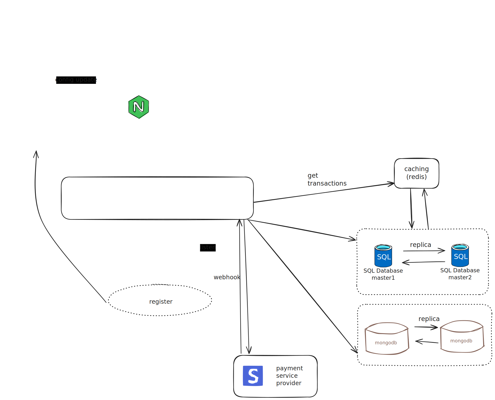

# microservices-payment-gateway

## How to start this project by using docker compose

1. Clone repo to local
2. Add the Certificate to Your Local Trust Store
- On macOS: Add the .crt file to the Keychain Access.
- On Linux: Add the .crt file to /usr/local/share/ca-certificates/ and run sudo update-ca-certificates.
- On Windows: Import the .crt into the Trusted Root Certification Authorities.
3. Make sure to use the project name "microservices-payment-gateway" during start and stop and down
`docker compose -p "microservices-payment-gateway" up -d`
4. If you want to use frontend for a stripe checkout page, navigate to packages/frontend,run
```pnpm i && npm run dev``` 
5. Use 4242 4242 4242 4242 as credit card number for testing. Enter any 3 digit CVC number.
6. all the secrets in the project are for testing purpose only.

## Postman collection

To simplify testing and interacting with the API endpoints, a Postman collection has been provided. This collection contains all available API requests, complete with example payloads and responses.

Please refer to [Postman Collection](./payment_api.postman_collection.json)

## Diagram to help you better understand the architecture
(The dotted line means it has not been implemented and can be optimzed)



This project implements a robust payment processing architecture to handle high volumes of transactions with a focus on scalability, security, and reliability. 

1. The system integrates with Stripe as the payment gateway, ensuring secure and seamless transaction processing. 
All sensitive payment data is handled through Stripe’s APIs to maintain compliance with PCI DSS.

2. Asynchronous Payment Handling:
Webhook-based architecture ensures real-time updates on payment statuses without blocking the main application flow. Since we're testing locally, webhook functionality cannot be used.

3. Database Scalability and Reliability:
Utilizes a master-master architecture for MySQL to handle large volumes of write and read operations during transactions.
Utilizes a master-master MongoDB architecture for user authentication, supporting high-concurrency scenarios.

4. Caching with Redis:
Reduces load on the database by caching frequently accessed data, such as user transaction histories.
Ensures high-speed data retrieval for a smooth user experience.
